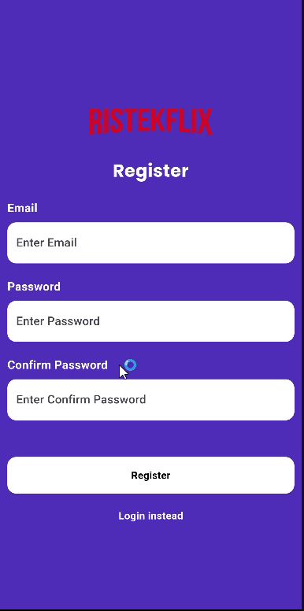
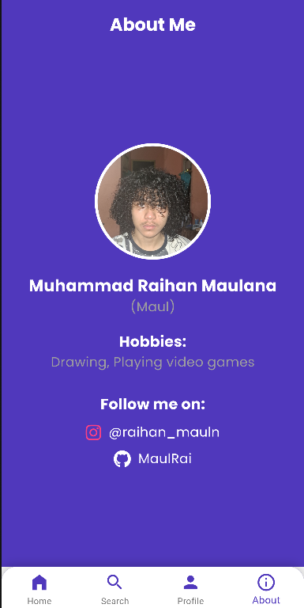

# ristekflix

## Lesson Learned

Pada proyek ini, hal utama yang saya pelajari adalah API call pada Flutter. Ternyata, 
proses pengambilan data dari server tidak sesederhana yang saya bayangkan. Saya harus 
memahami bagaimana cara mengirim permintaan HTTP, mengelola respons yang diterima, serta 
menangani berbagai skenario seperti error handling dan caching untuk meningkatkan efisiensi 
aplikasi. Selain itu, saya juga belajar tentang cara mengelola state agar data yang 
ditampilkan selalu up-to-date tanpa membebani performa aplikasi. Dengan pemahaman ini, 
saya semakin yakin bahwa membangun aplikasi mobile tidak hanya tentang tampilan yang 
menarik, tetapi juga bagaimana data dikelola dengan optimal untuk memberikan pengalaman 
terbaik bagi pengguna.

Saat mengimplementasi modul SearchScreen, saya mencoba untuk melakukan API call yang berbasis 
interval waktu agar pencarian menjadi lebih responsif. Awalnya, saya langsung memanggil 
API setiap kali pengguna mengetikkan huruf baru dalam kolom pencarian. Namun, saya segera 
menyadari bahwa pendekatan ini menyebabkan banyak permintaan yang tidak perlu, 
memperlambat aplikasi, dan meningkatkan penggunaan kuota API secara signifikan.

Selanjutnya, saya juga menyadari bahwa Clean Architecture sangat berpengaruh terhadap 
skalabilitas dan kemudahan pemeliharaan aplikasi. Code logic yang langsung di dalam widgets 
akan membuat kode sulit dibaca dan diperbaiki seiring bertambahnya fitur. Seiring waktu, 
saya mulai memahami pentingnya menerapkan Clean Architecture untuk memisahkan business 
logic, data layer, dan presentation layer. Adapun untuk struktur projek, saya memisahkannya 
menjadi authentication, helpers, repository, screens, services, dan widgets.

Implementasi ini mengajarkan saya bahwa dalam pengembangan aplikasi mobile, performa dan 
efisiensi harus selalu dipertimbangkan, terutama saat berinteraksi dengan API. Tidak hanya 
sekadar memastikan bahwa fitur bekerja, tetapi juga bagaimana fitur tersebut dapat berjalan 
dengan optimal untuk memberikan pengalaman terbaik bagi pengguna.

Demonstrasi register

Demonstrasi laman utama

Demonstrasi laman search

Demonstrasi laman profil, notice perubahan feedsnya yanh menyesuaikan

Tampilan laman about

